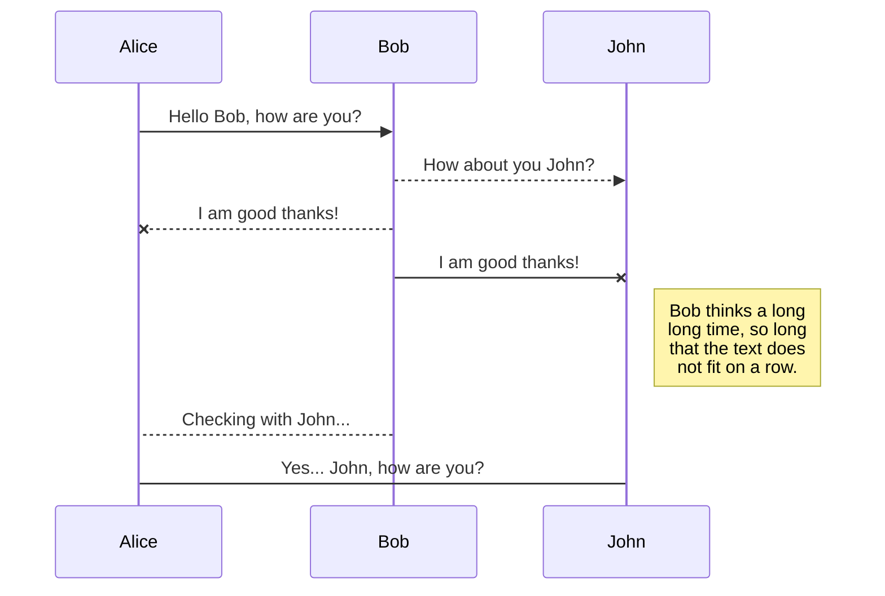
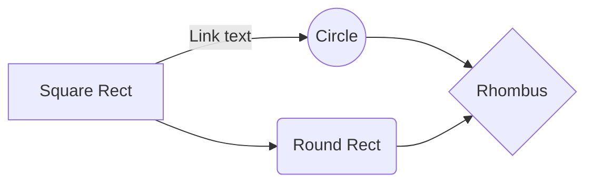

**Table of Contents**

[TOCM]

[TOC]

# H1 header
## H2 header
### H3 header
#### H4 header
##### H5 header
###### H6 header
# Heading 1 link [Heading link](https://github.com/pandao/editor.md "Heading link")
## Heading 2 link [Heading link](https://github.com/pandao/editor.md "Heading link")
### Heading 3 link [Heading link](https://github.com/pandao/editor.md "Heading link")
#### Heading 4 link [Heading link](https://github.com/pandao/editor.md "Heading link") Heading link [Heading link](https://github.com/pandao/editor.md "Heading link")
##### Heading 5 link [Heading link](https://github.com/pandao/editor.md "Heading link")
###### Heading 6 link [Heading link](https://github.com/pandao/editor.md "Heading link")

## Headers (Underline)

H1 Header (Underline)
=============

H2 Header (Underline)
-------------

### Characters
                
----

~~Strikethrough~~ <s>Strikethrough (when enable html tag decode.)</s>
*Italic*      _Italic_
**Emphasis**  __Emphasis__
***Emphasis Italic*** ___Emphasis Italic___

Superscript: X<sub>2</sub>，Subscript: O<sup>2</sup>

**Abbreviation(link HTML abbr tag)**

The <abbr title="Hyper Text Markup Language">HTML</abbr> specification is maintained by the <abbr title="World Wide Web Consortium">W3C</abbr>.

### Blockquotes

> Blockquotes

Paragraphs and Line Breaks
                    
> "Blockquotes Blockquotes", [Link](http://localhost/)。

### Links

[Links](http://localhost/)

[Links with title](http://localhost/ "link title")

`<link>` : <https://github.com>

[Reference link][id/name] 

[id/name]: http://link-url/

GFM a-tail link @pandao

### Code Blocks (multi-language) & highlighting

#### 
`$ npm install marked`

#### Code Blocks (Indented style)

Indented 4 spaces, like `<pre>` (Preformatted Text).

    <?php
        echo "Hello world!";
    ?>
    
Code Blocks (Preformatted text):

    | First Header  | Second Header |
    | ------------- | ------------- |
    | Content Cell  | Content Cell  |
    | Content Cell  | Content Cell  |

#### Javascript　

```javascript
function test(){
	console.log("Hello world!");
}

#### HTML code

```html
<!DOCTYPE html>
<html>
    <head>
        <mate charest="utf-8" />
        <title>Hello world!</title>
    </head>
    <body>
        <h1>Hello world!</h1>
    </body>
</html>
```
### FlowChart

```flow
st=>start: Login
op=>operation: Login operation
cond=>condition: Successful Yes or No?
e=>end: To admin

st->op->cond
cond(yes)->e
cond(no)->op
```

### Sequence Diagram
                    
```seq
Andrew->China: Says Hello 
Note right of China: China thinks\nabout it 
China-->Andrew: How are you? 
Andrew->>China: I am good thanks!
```

### End

## UML diagrams

You can render UML diagrams using [Mermaid](https://mermaidjs.github.io/). For example, this will produce a sequence diagram:



And this will produce a flow chart:


